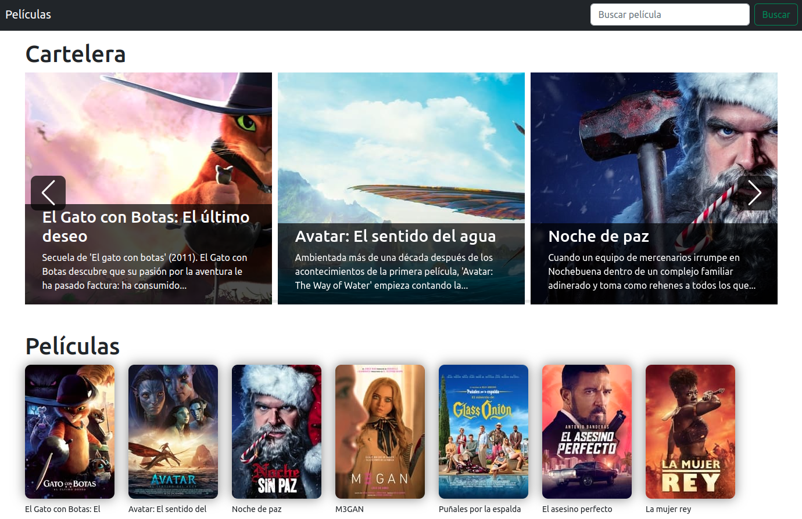
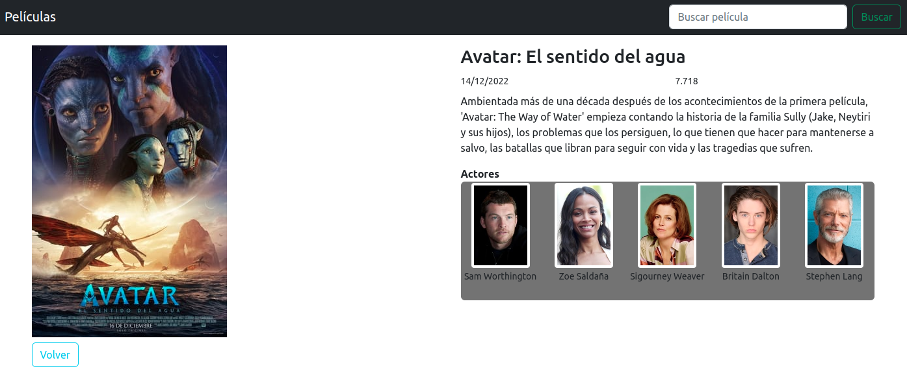

# Peliculas - Angular 14

Este proyecto se ha generado con [Angular CLI](https://github.com/angular/angular-cli) version 14.0.2.

## Listado de películas

Por un lado tenemos un slideshow con las primeras peliculas, y por otro un scroll infinito con el listado de todas las películas. Además se permite buscar



## Detalle de una película

Se muestran los datos de la película seleccionada y un slideshow con los actores y actrices



## Instalación de dependencias

Ejecuta `npm install` para instalar las dependencias

## Antes de servir la aplicación

Es necesario una `api_key` para añadirla en `peliculas.service.ts`

```js
get params() {
    return {
      api_key: 'AQUI_TIENES_QUE_PONER_TU_API_KEY',
      language: 'es-ES',
      page: this.carteleraPage.toString()
    }
  }
```

Para generar esta `api_key` debes ir a la web [TMDB](https://www.themoviedb.org/), registrarte y seguir los pasos. Es totalmente gratuito

## Development server

Abre un Terminal y ejecuta `ng serve` para arrancar el servidor de desarrollo. Navega a `http://localhost:4200/`

O ejecuta `ng serve -o` y, en el navegador configurado por defecto, se abrirá automátcamente en la ruta `http://localhost:4200/`


